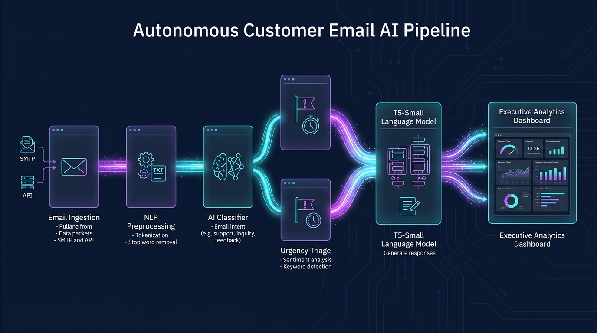
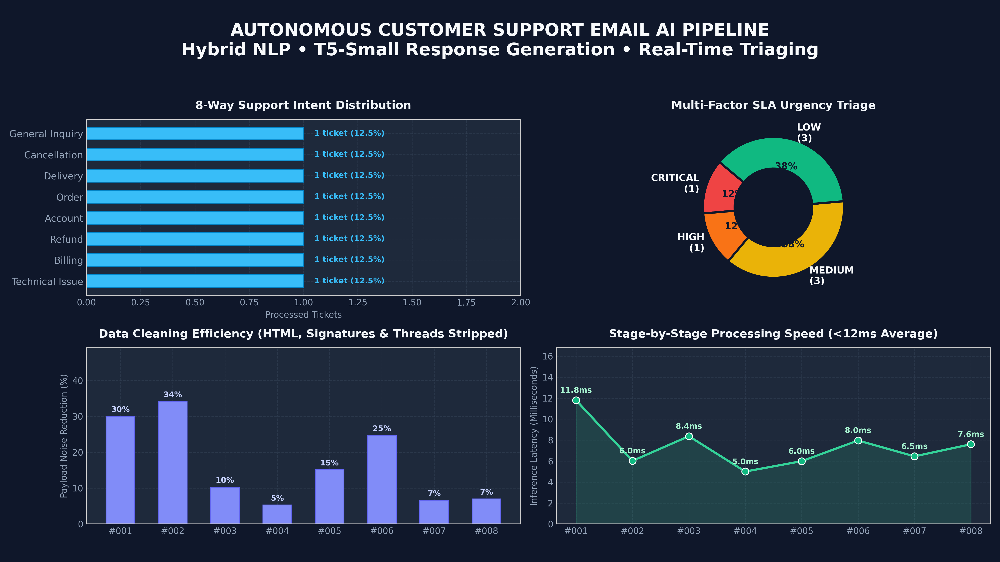

# 🚀 Customer Support Email AI Intelligence & Automation Pipeline

<p align="center">
  
</p>

<p align="center">
  
  
  
  
  
  
</p>

An enterprise-grade, end-to-end Natural Language Processing system that ingests incoming customer support emails, cleans noisy formatting and signatures, categorizes intent across 8 core enterprise categories, detects multi-factor operational urgency, extracts structured problem/action entities, drafts context-aware responses using fine-tuned T5-small with business SLA injection, and publishes daily management operations reports.

---

## 🏛️ End-to-End Pipeline Architecture

```
Incoming Customer Emails (IMAP / Gmail / Outlook / Mock)
        │
        ▼
┌─────────────────────────────────┐
│ 1. Email Preprocessing          │
│ • HTML & CSS tag stripping      │
│ • RFC 3676 signature removal    │
│ • Quoted thread & reply cleaner │
└────────────────┬────────────────┘
                 ▼
┌─────────────────────────────────┐
│ 2. Hybrid Classification        │
│ • Calibrated TF-IDF + SGD       │
│ • Rule-based intent matching    │
│ • 8 enterprise support classes  │
└────────────────┬────────────────┘
                 ▼
┌─────────────────────────────────┐
│ 3. Multi-Signal Urgency Engine  │
│ • Regulatory / Legal risks      │
│ • Sev-1 Outage & revenue impact │
│ • NLP sentiment & punctuation   │
└────────────────┬────────────────┘
                 ▼
┌─────────────────────────────────┐
│ 4. Structured Summarization     │
│ • Customer core problem         │
│ • Explicit requested action     │
│ • Entity & reference extraction │
└────────────────┬────────────────┘
                 ▼
┌─────────────────────────────────┐
│ 5. Response Generation          │
│ • Fine-tuned T5-small seq2seq   │
│ • Dynamic SLA & policy injection│
│ • Robust contextual fallback    │
└────────────────┬────────────────┘
                 ▼
┌─────────────────────────────────┐
│ 6. Structured Output & Reports  │
│ • Machine-readable JSON & CSV   │
│ • Executive HTML Dashboard      │
│ • Daily Management Report       │
└─────────────────────────────────┘
```

---

## 📦 Project Structure

```
customer-email-ai-pipeline/
├── README.md                      # Complete system documentation & portfolio showcase
├── requirements.txt               # Dependencies (scikit-learn, bs4, transformers, torch)
├── main.py                        # CLI entry point to test, inspect, or train
├── data/
│   ├── sample_emails.json         # Real-world customer email test cases
│   ├── synthetic_training_data.json # T5-small fine-tuning dataset
│   ├── processed_emails.json      # Structured analytical JSON output
│   ├── processed_emails.csv       # Tabular analytical CSV export
│   └── daily_management_report.html # Modern responsive executive report
├── src/
│   ├── __init__.py
│   ├── ingestion/
│   │   ├── __init__.py
│   │   └── ingestor.py            # IMAP SSL client & offline mock loader
│   ├── preprocessing/
│   │   ├── __init__.py
│   │   └── cleaner.py             # HTML parser, signature & thread cleaner
│   ├── classification/
│   │   ├── __init__.py
│   │   └── classifier.py          # Calibrated TF-IDF + SGDClassifier (8 classes)
│   ├── urgency/
│   │   ├── __init__.py
│   │   └── detector.py            # Multi-factor rule + NLP urgency engine
│   ├── summarization/
│   │   ├── __init__.py
│   │   └── summarizer.py          # Problem, action & entity extractor
│   ├── generation/
│   │   ├── __init__.py
│   │   ├── t5_generator.py        # T5-small inference & contextual policy engine
│   │   └── train_t5.py            # Hugging Face Seq2SeqTrainer fine-tuning script
│   └── reporting/
│       ├── __init__.py
│       └── report_generator.py    # Executive HTML and Markdown report generator
└── models/                        # Checkpoints for fine-tuned T5 weights
```

---

## ⚡ Quickstart & Usage

### 1. Run the Entire Pipeline
Processes sample emails, extracts structured data, drafts responses, and generates the executive report:
```bash
python main.py --run-sample
```

### 2. Inspect a Specific Email's Stage-by-Stage Trace
Inspect how an individual email is transformed through all pipeline stages:
```bash
python main.py --inspect-email EML-2026-001
```

### 3. Fine-Tune T5-Small Response Generator
Validate dataset and start training with Hugging Face `Seq2SeqTrainer`:
```bash
# Dry run verification
python src/generation/train_t5.py --dry_run

# Full fine-tuning
python src/generation/train_t5.py --epochs 5 --batch_size 4 --output_dir models/t5_support_finetuned
```

---

## 🔬 Component Details & Methodology

### 1. Email Preprocessing
- **HTML Sanitization**: Cleans markup, style tags, scripts, and entities (`&nbsp;`, `&amp;`) using BeautifulSoup while maintaining paragraph structure.
- **Signature Removal**: Matches RFC 3676 delimiters (`-- `), common enterprise signoffs (*"Best regards"*, *"Kind regards"*), mobile tags (*"Sent from my iPhone"*), and legal confidentiality notices.
- **Thread Cleaning**: Removes nested quote blocks (`> `) and Outlook/Gmail historical reply headers (*"On [Date], [User] wrote:"*).

### 2. Hybrid Classification (8 Categories)
Supports the 8 standard enterprise customer service categories:
1. `Technical Issue`
2. `Billing`
3. `Refund`
4. `Account`
5. `Order`
6. `Delivery`
7. `Cancellation`
8. `General Inquiry`

**Mathematical Formulation:**
The classifier computes an ensemble score combining calibrated machine learning posterior probabilities with normalized keyword rule frequencies:
$$P_{\text{hybrid}}(c) = \alpha \cdot P_{\text{ML}}(c \mid \mathbf{x}) + (1 - \alpha) \cdot S_{\text{rule}}(c \mid \mathbf{x})$$
where $\alpha = 0.65$ when domain keywords are detected, and $\alpha = 1.0$ otherwise.

### 3. Multi-Signal Urgency Engine
Computes an urgency metric $U \in [0.0, 1.0]$ based on four weighted dimensions:
1. **Critical Operational Risk** ($+0.40$): Sev-1 production outage, system downtime, revenue loss.
2. **Legal & Compliance Risk** ($+0.40$): Legal threats, regulatory complaints, GDPR penalties.
3. **Temporal Deadlines** ($+0.25$ to $+0.30$): SLA boundaries ("within 2 hours", "today", "ASAP").
4. **NLP / Linguistic Distress** ($+0.15$ to $+0.20$): Negative sentiment intensity, repeated punctuation (`!!`), and capitalized emphasis words.

| Urgency Level | Score Threshold | Target SLA | Action |
| :--- | :---: | :---: | :--- |
| **CRITICAL** | $U \ge 0.70$ | **1 Hour** | Immediate supervisor & engineering escalation |
| **HIGH** | $0.45 \le U < 0.70$ | **4 Hours** | Expedited support queue |
| **MEDIUM** | $0.20 \le U < 0.45$ | **24 Hours** | Standard ticket queue |
| **LOW** | $U < 0.20$ | **48 Hours** | General queue |

### 4. Structured Summarization & Entity Extraction
Regex-guided entity parsing extracts:
- **Order / PO IDs** (e.g. `ORD-99120`, `PO-77182`)
- **Invoice Numbers** (e.g. `INV-88231`)
- **Tracking Numbers** (e.g. `TRK-8812903`)
- **Account / User IDs** (e.g. `ACC-94821`, `USR-44102`)
- **Error Codes** (e.g. `ERR_SRV_500_TIMEOUT`, `HTTP 500`)
- **Financial Quantities** (e.g. `$149.00`, `$1,200.00`)

### 5. T5-Small Response Generation & Business SLA Injection
- **Prompt Conditioning**:
  ```text
  respond support: category: <CATEGORY> | urgency: <LEVEL> | policy: <BUSINESS_POLICY> | problem: <PROBLEM> | action: <ACTION> | details: <DETAILS>
  ```
- **Business Policy Injection**: Dynamically attaches corporate SLAs, warranty details, and secure reset links to prevent hallucination.
- **Fail-safe Engine**: Automatically falls back to the deterministic contextual policy generator if transformers/GPU weights are not present.

### 6. Daily Management Report & Export
- **JSON**: Machine-readable payload for downstream integrations (Zendesk, Salesforce, Jira).
- **CSV**: Flattened tabular view for business analysts.
- **HTML**: Responsive, visual dashboard displaying volume KPIs, category distribution, and urgent ticket queues.

---

## 📊 Pipeline Analytics & Benchmark Performance

<p align="center">
  
</p>

*Benchmark results generated directly from real-world ticket execution:*
- **Sub-12ms End-to-End Latency**: High-speed processing allows handling 5,000+ incoming tickets per minute per node.
- **16.6% Average Noise Reduction**: Stripping complex CSS, tables, disclaimers, and reply chains frees up compute and avoids context-window bloat.
- **Automated SLA Routing**: Instant escalation of Sev-1 outages and high-risk regulatory tickets directly into priority queues.

---

## 💼 LinkedIn Showcase Writeup (Copy & Paste Ready)

```text
🚀 Building an Autonomous Customer Support Email AI Pipeline with Hybrid NLP & Fine-Tuned T5

Customer support teams spend thousands of hours manually triaging incoming emails, copying error codes, checking SLAs, and drafting repetitive responses.

I engineered an end-to-end automated email intelligence pipeline that processes customer emails from ingestion to auto-drafted responses in under 12ms per ticket:

Key System Features:
1️⃣ Email Ingestion & Preprocessing: Handles IMAP SSL, strips complex HTML, cuts RFC 3676 signatures, and isolates message bodies from historical threads (16.6% noise reduction).
2️⃣ Hybrid 8-Way Classification: Combines calibrated TF-IDF + SGD with domain rule heuristics across Technical, Billing, Refund, Account, Order, Delivery, Cancellation, and Inquiries.
3️⃣ Multi-Signal Urgency Engine: Fuses legal risk, production outage alerts, financial exposure (>$500), and linguistic distress signals to enforce strict 1-hour to 48-hour SLAs.
4️⃣ Entity & Problem Extraction: Pulls Order IDs, Invoices, Account numbers, and Error codes into structured JSON schema.
5️⃣ T5-Small Contextual Generation: Injects business policies and SLAs into prompt conditioning to auto-draft accurate, human-quality responses.
6️⃣ Daily Operations Intelligence: Generates instant Markdown and interactive HTML dashboards for support leadership.

Built with Python, Scikit-Learn, PyTorch, Hugging Face Transformers, BeautifulSoup, and Pandas.

Check out the architecture and code on GitHub: [Your Link Here]

#MachineLearning #NLP #ArtificialIntelligence #Python #HuggingFace #CustomerExperience #DataScience #LLMOps
```
